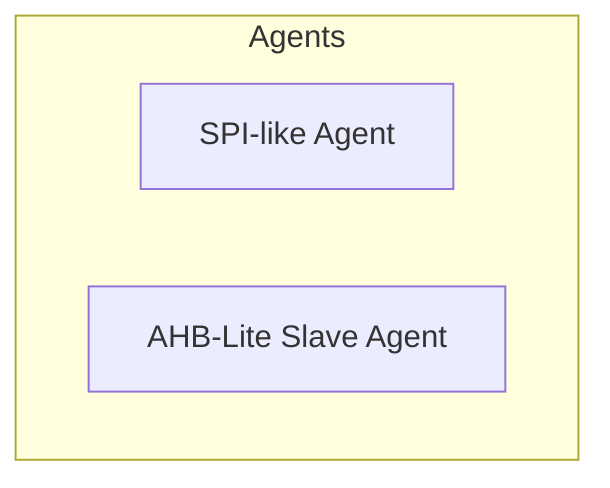
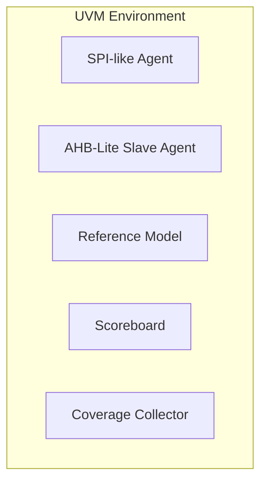
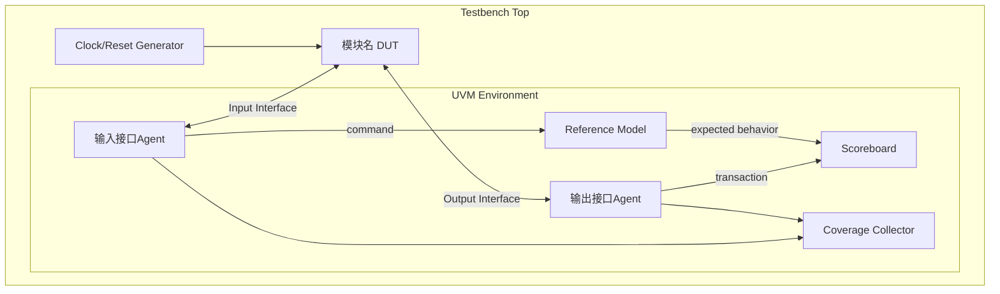

# 验证环境框图绘制规则

## 1. Agent独立显示规则

**规则**：每个Agent必须独立显示，不能放在同一个框内

**错误示例**：


**正确示例**：


## 2. 通过Interface连接

**规则**：Agent与DUT的交互必须通过Interface，连线上需标注Interface名称

**示例**：
```mermaid
SPI_AGENT <-->|SPI Interface| DUT
DUT <-->|AHB-Lite Interface| AHB_AGENT
```

## 3. 双向箭头使用规则

**规则**：
- 双向交互（请求+响应）使用双向箭头 `<===>`
- 单向交互使用单向箭头 `-->`

**双向交互示例**：
- Agent与DUT的请求-响应交互
- 总线Master与Slave的交互

**单向交互示例**：
- Agent到Reference Model的命令传递
- Agent到Coverage Collector的数据传递

## 4. Clock/Reset Generator连接规则

**规则**：Clock/Reset Generator只连接DUT

**正确**：
```mermaid
CLK[Clock/Reset Generator]
CLK --> DUT
```

**错误**：
```mermaid
CLK --> SPI_AGENT
SPI_AGENT --> DUT
```
Agent不应通过CRG连接到DUT。

## 5. 数据流连线完整性

**必须画出的连线**：

| 源 | 目标 | 说明 |
|---|---|---|
| 输入Agent | DUT | 通过Interface双向连接 |
| DUT | 输出Agent | 通过Interface双向连接 |
| 输入Agent | Reference Model | 命令传递 |
| 输出Agent | Scoreboard | 事务传递 |
| Reference Model | Scoreboard | 期望值传递 |
| 所有Agent | Coverage Collector | 覆盖率数据收集 |

## 6. 不画多余的线

**规则**：
- DUT和Agent之间只画必要的Interface连线
- 不要画重复的连线
- 不要画不存在的数据流路径

## 7. 通用框图模板



## 8. 根据LRS接口类型确定Agent名称

| LRS接口类型 | Agent名称 |
|---|---|
| SPI类接口 | SPI-like Agent |
| I2C接口 | I2C Agent |
| UART接口 | UART Agent |
| AHB总线（Slave） | AHB-Lite Slave Agent |
| AHB总线（Master） | AHB-Lite Master Agent |
| AXI总线 | AXI Agent |
| APB总线 | APB Agent |
| 自定义接口 | 按接口功能命名 |
