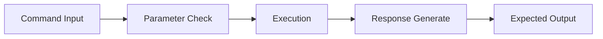
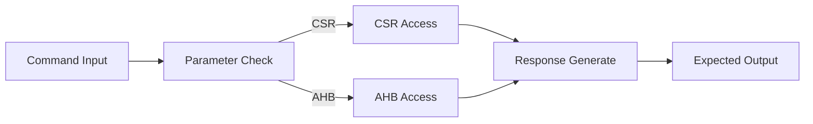
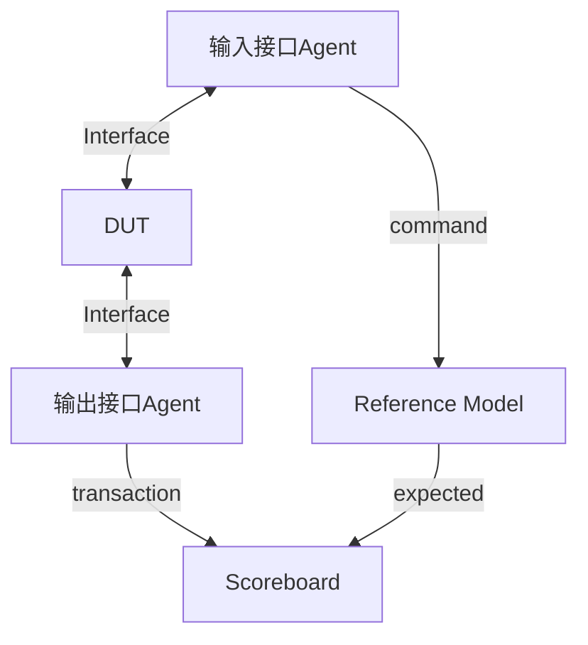
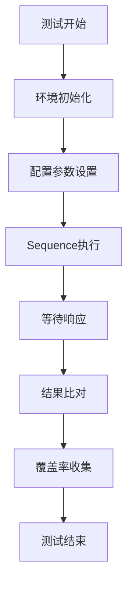
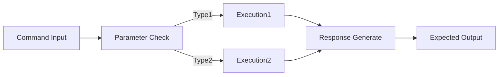

# Mermaid流程图规则

> **重要**：本规则为**备选方案**。
>
> **默认方案**：使用 architecture-diagram skill 生成 HTML+SVG 框图，配合 selenium+Chrome 截图插入 Word 文档。
>
> **使用 Mermaid 的场景**：
> - 无法使用 Chrome 浏览器截图的环境
> - 需要快速生成简单流程图
> - 文档平台原生支持 Mermaid 渲染

## 1. 所有节点必须连接

**核心规则**：流程图中的每个节点都必须有输入和输出连线，不允许出现孤立节点。

**错误示例**：
```mermaid
flowchart LR
    CMD[Command Input]
    CHK[Parameter Check]
    EXEC[Execution]
    RESP[Response Generate]
    OUT[Expected Output]

    CMD --> CHK
    EXEC --> RESP   <!-- EXEC没有输入，是孤立节点 -->
    RESP --> OUT
```

**正确示例**：


## 2. 流程完整性

### 起始节点
- 只能有一个输入（为空）
- 必须有输出

### 结束节点
- 只能有一个输出（为空）
- 必须有输入

### 中间节点
- 必须同时有输入和输出
- 不能悬空

## 3. 分支处理规则

使用分支时，确保每个分支都能到达结束节点：

**正确示例**：


## 4. 常见流程图示例

### 验证环境数据流图


### Testcase执行流程图


### Reference Model流程图


## 5. 检查清单

生成文档前，检查：
- [ ] 每个节点是否都有连线？
- [ ] 是否有孤立节点？
- [ ] 分支是否都能到达结束节点？
- [ ] 流程是否完整？
