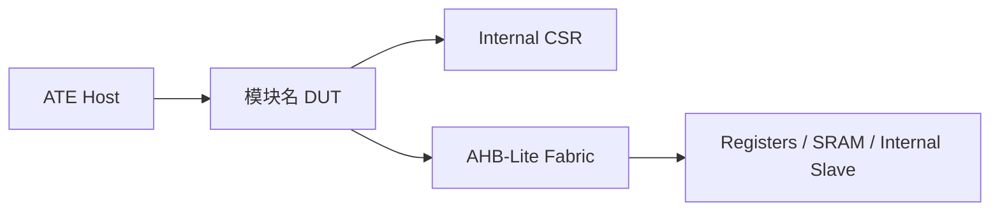

# 模板理解规则

## 1. 斜体占位符识别与填充

模板格式：`*斜体文本*` 表示需要填充的占位符

**规则**：
- 识别所有斜体内容
- 根据LRS文档填充对应内容
- 填充时保持语义一致

## 2. 固定内容保持规则

以下内容是模板固定内容，不可修改或扩展：

**3.2节验证平台和方法学**：
```
使用VCS仿真器，基于UVM验证方法学进行仿真验证。
```
- 这是一行固定内容，不应在此节添加"验证环境组成"等其他内容
- 如需添加验证环境组成描述，应放到4.2节

**1.1节目的**：
- 这是固定的目的描述，不应修改

**1.2节范围**：
- 固定为"团队内查阅。"

## 3. 内容来源约束

**核心原则**：所有内容必须来源于LRS文档

**禁止行为**：
- 不要凭空添加LRS中没有的内容
- 不要添加内部架构组成等LRS未描述的信息
- 不要添加"Golden子模块处理"等模板中没有的内容

**示例**：
- 如果LRS没有描述内部二级模块结构，验证方案不应包含"架构组成"表格
- 如果LRS只描述了外部接口，不应添加内部实现细节

## 4. 参考文档来源规则

**核心原则**：只列出用户提供的LRS文档

**禁止行为**：
- 不要添加"SoC集成规范"等用户未提供的文档
- 不要添加"模块功能与接口规格"等未提供的文档
- 不要凭空添加"测试模式控制与安全访问约束文档"等

**正确做法**：
```
1.3 参考文档
• {用户提供的LRS文档名称}
```

**错误做法**：
```
1.3 参考文档
• APLC-Lite 逻辑规格说明书（LRS）v0.1
• APLC-Lite SoC Spec（模块功能与接口规格）  ← 未提供
• SoC AHB-Lite 集成规范  ← 未提供
• 测试模式控制与安全访问约束文档  ← 未提供
```

## 5. 架构图必须绘制

**规则**：2.1节必须包含mermaid架构图

**正确做法**：


**禁止行为**：
- 只有文字描述，没有架构图
- 架构图过于简单，没有体现模块位置和连接关系

## 6. 验证策略必须完整

**规则**：每个验证难点都必须有对应的应对策略

**正确做法**：
```
验证难点：
• 半双工协议时序控制：请求阶段和响应阶段的切换
  - 应对策略：设计专门的时序检查checker，监控方向切换点
• 错误场景覆盖：协议/帧异常、参数/命令异常
  - 应对策略：编写定向测试用例，使用功能覆盖点跟踪
```

**错误做法**：
```
验证难点：
• 半双工协议时序控制：请求阶段和响应阶段的切换  ← 缺少应对策略
• 错误场景覆盖：协议/帧异常  ← 缺少应对策略
```

## 7. 目录结构保护

**规则**：
- 严格遵守模板的章节编号
- 不能增加或删除一级章节（1-7）
- 不能增加或删除二级章节
- 章节标题可以微调但不改变层级

**章节结构**：
```
1. 简介
   1.1 目的
   1.2 范围
   1.3 参考文档
2. DUT设计介绍
   2.1 设计架构图
   2.2 模块主要特性
   2.3 控制和数据流
3. 验证策略
   3.1 验证重点和难点
   3.2 验证平台和方法学
   3.3 自动化验证策略
   3.4 验证阶段划分
4. 验证平台架构
   4.1 验证环境示意图
   4.2 验证组件实现方案
      4.2.1 Agent实现方案
      4.2.2 Reference model实现方案
      4.2.3 Checker实现方案
   4.3 覆盖率方案
   4.4 环境重用方案
5. Formal验证方案
6. Testcase验证用例方案
   6.1 Testcase执行流程
   6.2 C-SV Cosim方案
7. Risks风险和应对措施
```

## 5. 正确示例

**错误做法**：在3.2节添加验证环境组成
```markdown
### 3.2 验证平台和方法学
使用VCS仿真器，基于UVM验证方法学进行仿真验证。

验证环境组成：
• DUT：XXX RTL 模块
• Agent：...
```

**正确做法**：固定内容保持不变，环境组成放到4.2节
```markdown
### 3.2 验证平台和方法学
使用VCS仿真器，基于UVM验证方法学进行仿真验证。
```
